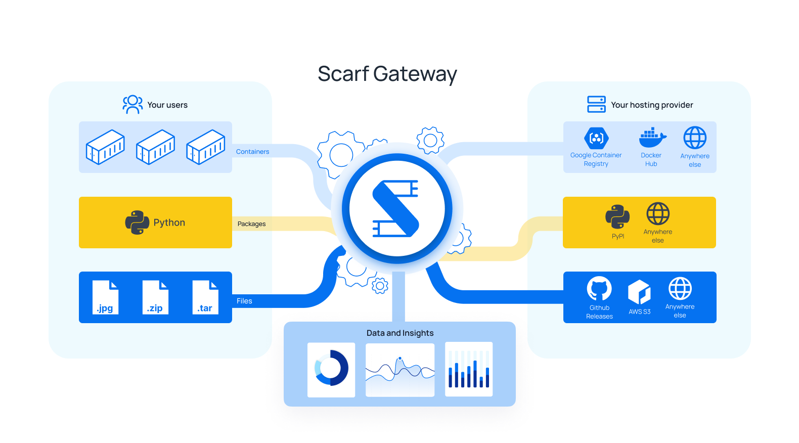
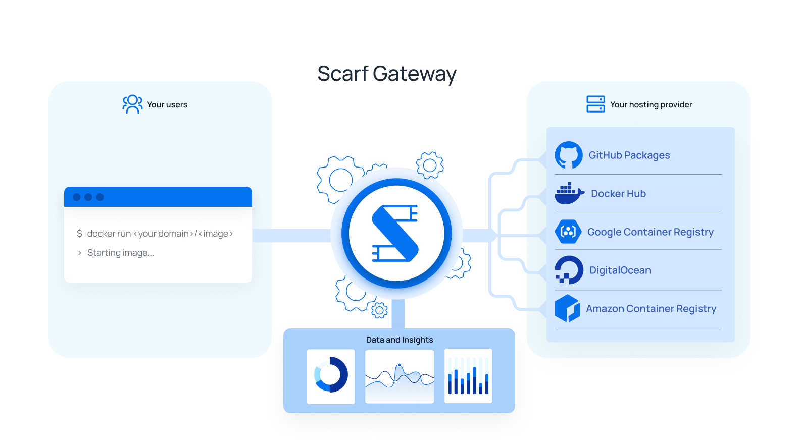
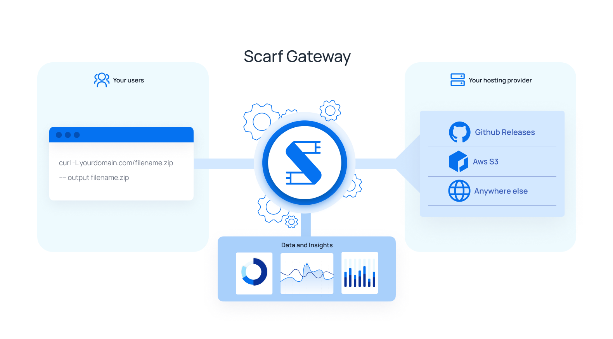
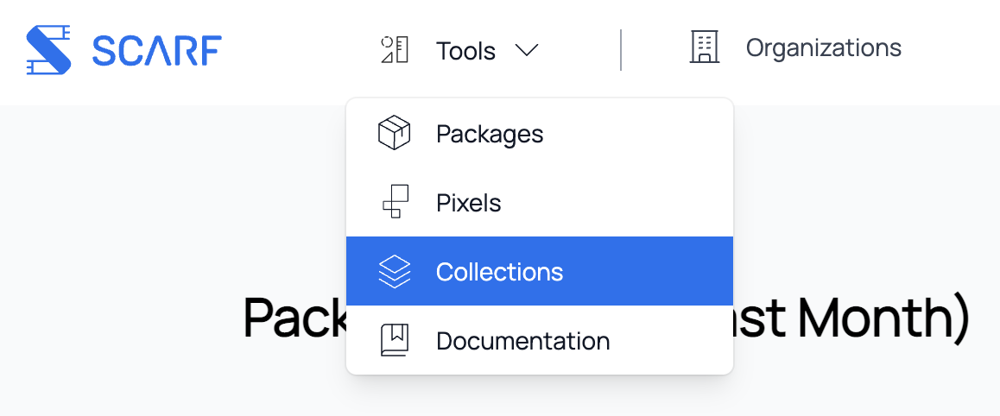
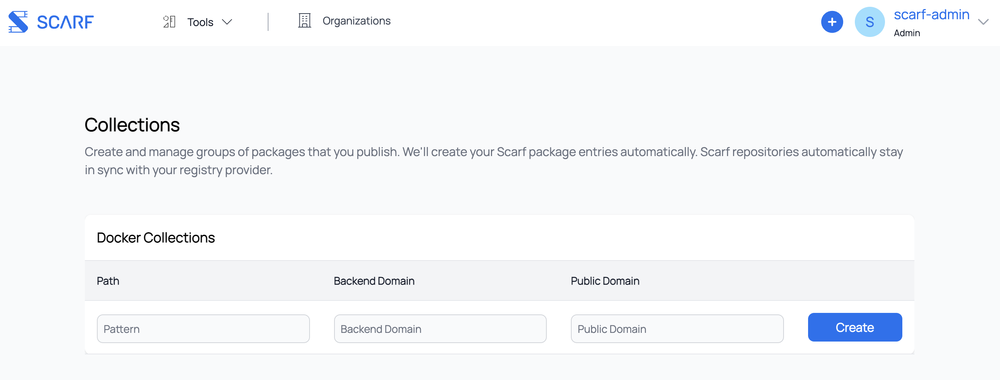

# Scarf Gateway

### 概述



Scarf网关是一项位于现有软件托管平台之前的服务，充当所有中间件的单一接入点，无论它们实际托管在何处。 Scarf网关使您可以轻松托管来自您自己域的内容，从而将您的分发与托管提供商分离，并提供深入的下载分析。

假设您在 Docker Hub 上维护一个 Docker 容器镜像  `acme/rocket-skates` . 您的用户通常会直接从 Docker 中心拉取您的容器镜像(`docker pull acme/rocket-skates`.) 使用 Scarf，他们会使用您的私有域 (`docker pull docker.acme.com/acme/rocket-skates`.) 在您使用 Scarf 时会记录重要分析并与您共享，您可以随时更改您的托管服务提供商，而无需更改您的容器镜像名称或文档。

您的用户将始终使用您的域来拉取您的 Docker 容器镜像。 您的 Docker 容器镜像可以保留在其当前的托管服务提供商处，但将通过您自己的域提供服务，例如：

```bash
# 让你通过你自己的域提供现有的可用容器
$ docker pull docker.acme.com/acme/rocket-skates

# 如果你想使用我们的域，Scarf 也提供了一个
$ docker pull acme.docker.scarf.sh/acme/rocket-skates
```

可以在 Scarf 仪表盘中找到有关 Docker 容器镜像下载的数据洞察。 从那里，您还可以管理 Scarf 网关配置、访问控制、等等。

### 配置

#### Scarf 包条目

通过 Scarf 网关提供和跟踪的所有内容都需要在 [scarf.sh](scarf.sh) 上有一个相应的包条目。配置、分析和权限都在包等级别或单个仓库中完成。 `rocket-skates`, `acme/rocket-skates` 都是有效的包条目。由于包可以无缝地更改其托管服务提供商， 因此主机名（例如 `gcr.io`）不是 Scarf 上包标识符的一部分（例如 `acme/rocket-skates` 而不是 `gcr.io/acme/rocket-skates`.）

要创建包条目，请单击 Scarf 仪表盘导航栏中的 "New Package" ，或者[单击此处](https://scarf.sh/create-package). 然后为您的中间件选择相应的包类型。

#### 容器镜像包



Docker 容器镜像条目的Scarf网关配置有两个主要考虑因素：

- **后端 URL：** 这是指你的容器实际托管的位置，也就是Scarf 将请求拉取容器的位置。Scarf 将询问您容器的当前拉取命令。这可能是 `rocket-skates`, `acme/rocket-skates` （隐式指定Docker Hub 作为托管服务提供商， `registry-1.docker.io/acme/rocket-skates`）， 或者一个完全限定的容器镜像名称 `docker.acme.come/acme/rocket-skates`. 您可以以后修改此后端 URL 属性，您的用户的 Docker 拉取将立即移动到新目的地，而无需与他们进行任何通知。
- **域：**这可以是您自己的域，也可以是 Scarf 提供的域，格式为 `<username>.docker.scarf.sh`. 如果此字段留空，将默认使用您的 Scarf 域。 请注意，这将成为您用户的 Docker pull 命令的一部分。 虽然您可以更新此域，但更新您的公共域对当前域中的任何用户来说都是一项重大更改！ 谨慎编辑此值。

如果您选择使用自己的域，则需要将该域的 CNAME 添加到 `gateway.scarf.sh`. 请参阅您的 DNS 提供商的说明，了解如何添加 CNAME。

请参见 [图 0](#figure_0) 以了解这些部分如何组合在一起。

#### 文件包



文件包入口的 Scarf网关配置主要考虑三个方面：

- **域：**就像 Docker 容器镜像一样，您可以选择使用自己的域来提供文件。 您也可以选择使用 Scarf 默认提供的 `<username>.gateway.scarf.sh` .请记住，如果您选择使用自己的域，则需要将该域的 CNAME 添加到 `gateway.scarf.sh`
- **传入路径：**这是指给定域上的路径，Scarf 将在其中定向请求以获取文件资产。 这可以是静态路径，例如`/downloads/rocket-skates.tar.gz` 也可以是带有变量的模板路径，例如 `/files/{version}/{platform}/rocket-skates-{platform}-{version}.tar.gz`. 您可以按照[RFC 6570](https://datatracker.ietf.org/doc/html/rfc6570)中的规定在您的传入路径中使用变量。您可以以后修改路径值，但要小心与您的用户沟通，因为这将是一个重大更改。
- **传出 URL：**这是 HTTP/S 托管提供商上您的资产的完整 URL。 它是一个模板（或静态）URL，也可以使用传入路径中定义的任何变量。 例如  `https://besthostingprovider.com/acme/{platform}/rocket-skates-{version}.tar.gz`

请参见 [图 3](#figure_3) 以了解这些部分如何组合在一起。

#### Python 包


Python 包入口的Scarf 网关配置主要考虑三个方面：

- **pip 命令：** 这是当前用于安装包的 pip 命令。 对于 PyPI.org 上的包，将采用  `pip install my-pkg` 的形式，并且如果您的包托管在其他地方，则将包括 `--extra-index-url https://my-python-project-domain.com`. 这定义了安装包时用户将被重定向到的位置。
- **域：**这可以是您自己的域，也可以是 Scarf 提供的域，格式为 `<username>.gateway.scarf.sh`. 默认情况下，如果此字段留空，将使用您的 Scarf 域。

#### 通过 requirements.txt 安装 Python 包
在 requirements.txt 的顶部添加 --extra-index-url 选项：

```
--extra-index-url https://my-python-project-domain.com/simple/
my-pkg==0.0.1
```

注意：我们注意到某些版本的 Pip 中的不确定行为导致公共注册表被用于下载，而不管是否添加了“--extra-index-url”参数。 这是一个特定于客户的问题，我们正在调查。

如果您选择使用自己的域，则需要将该域的 CNAME 添加到 `gateway.scarf.sh`.  请参阅您的 DNS 提供商的说明，了解如何添加 CNAME。

### 如何运行？

当用户通过 Scarf 请求 Docker 容器镜像时，Scarf 只需发出重定向响应，指向您为容器配置的任何托管服务提供商。 某些容器运行时在身份验证期间无法正确处理重定向（即使是匿名拉取也是必需的），并且在这些情况下，Scarf 会将请求代理到主机而不是重定向。 要从最终用户的角度看系统的可视化，请参见 [图 1](#figure_1). 要查看整个系统的概览，请参见 [图 2](#figure_2).

当用户通过 Scarf 请求文件时，Scarf 只需发出重定向响应，指向您为文件配置的任何托管服务提供商。 要从最终用户的角度看系统的可视化，请参见 [图 4](#figure_4). 要查看整个系统的概览，请参见 [图 5](#figure_5)。

仪表盘和数据访问

您的包的使用数据将在您的 Scarf 仪表盘中提供给您。 您也可以从您包的详细信息页面授予其他人访问您包的使用数据的权限。当前支持的权限级别是：

| 访问级别 | 说明                                                         |
| -------- | ------------------------------------------------------------ |
| 所有者   | 可以读取所有包级数据、编辑包配置并授予其他成员访问权限       |
| 管理员   | 可以读取所有包级数据，编辑包配置，并授予其他成员访问权限（但不能删除其他管理员） |
| 会员     | 可以读取所有包级数据                                         |

Scarf 尚不支持组织级权限，但很快就会支持。

#### Docker 包：定义容器拉取

Scarf 根据 [Docker Hub defines them](/docker-hub/download-rate-limit/) 来定义拉取。

拉取定义为对托管提供商清单 URL (`/v2/*/manifests/*`)的一个或多个 `GET`请求。 HEAD 请求不算作拉取。

请注意，即使客户端下载了包含任何给定容器的 blob，容器的清单文件可能已经缓存在客户端上，这意味着下载不会计入 Scarf 的分析。 Scarf 数据处理管道的未来版本将更加智能，并将跟踪部分下载、blob 提取等内容。

#### 安全

通过 Scarf网关的所有交互都通过 HTTPS 进行。 Scarf Gateway 将通过  [LetsEncrypt ](https://letsencrypt.org)获取有效的 TLS 证书，并对流量进行 TLS 终止。Scarf 网关反过来会为请求发出重定向，或将请求代理到托管服务提供商。

#### 不跟踪

我们的网关遵循 [DNT](https://www.w3.org/2011/tracking-protection/drafts/tracking-dnt.html) 和 [GPC](https://developer.mozilla.org/en-US/docs/Web/HTTP/Headers/Sec-GPC) 中定义的 HTTP 标头。如果您向我们的 Scarf 网关发送带有 HTTP 标头 "DNT=1" 或 "Sec-GPC=1"的 HTTP 请求， 我们不会将您的请求计入我们的统计数据中，也不会查找您的 IP 地址以确定您是否是企业。 基本上，就好像您没有从我们的网关请求任何内容，但我们仍会为您提供内容。

请注意，此行为适用于通过我们的网关提供的所有包和像素。 如果用户在其浏览器设置中启用了 DNT，我们将不会跟踪文件下载或像素浏览量。

### 可用性

Scarf 网关是一项免费托管服务，按原样和可用状态提供给维护人员和用户。

Scarf 网关部署在全球多个区域的 AWS 上； 它甚至可以容错整个区域离线，并且可以自动弹性扩展我们的后端容量以满足我们任何用户流量需求。

我们期望达到每月 99.9% 的服务正常运行时间百分比。 我们的服务级别协议的保证将在未来提供。

要查看 Scarf 的正常运行时间和系统状态，您可以在[此处](https://status.scarf.sh)查看状态页面。

### 徽章

Scarf 网关上的所有包都自动提供动态的 Scarf-powered README 徽章。 前往您的包页面，徽章将显示在顶部附近的详细信息部分。 复制 URL，根据您使用的任何文档格式将其粘贴到项目的 README 中，一切就绪。


**下载徽章和公司徽章有什么区别？**

商业用途徽章显示了上个月有多少不同的公司被识别为获取您的 Scarf Gateway 包。下载徽章报告所有用户的下载总数。

这个徽章的用途是什么？

README徽章可让您通过共享有关下载流量和企业级的高级实时数据来展示您的项目，以便读者可以快速评估有关您项目的一些基本细节。 Scarf-powered README 徽章是一种公开共享项目使用数据的简单方法，无论您的文档在互联网上的哪个位置呈现。 告诉潜在的新用户有多少公司使用您的项目是表明您的项目可靠且值得采用的好方法。

徽章的URL格式是什么

徽章可用于以下格式：

- 公司徽章
    - https://scarf.sh/package/company-badge/{package-id}
    - https://scarf.sh/company-badge/{username}/{package-name}?package-type={package-type}

- 下载徽章
    - https://scarf.sh/package/installs-badge/{package-id}
    - https://scarf.sh/installs-badge/{username}/{package-name}?package-type={package-type}

您还可以通过查询字符串将一些额外的设置传递给徽章：`color`, `label-color`, `logo`, `logo-color` 和 `style`. 例如，`https://scarf.sh/package/installs-badge/{package-id}?color=red&style=flat`. 请参阅 https://shields.io/#colors 以了解有关每个设置支持的值的更多信息。

### <a name="caveats"></a>注意事项和限制

如果您在多个不同的注册表上有 Docker 容器镜像，您目前需要使用多个不同的子域（每个托管服务提供商一个）。 此限制是由于 Docker 注册表授权的当前实施。 要开始拉取容器，需要发送身份验证请求，该请求必须传递给您配置 Scarf 网关使用的托管服务提供商。 遗憾的是，初始授权请求不包含任何关于它试图拉取什么镜像的信息，所有 Scarf 网关必须在最开始继续使用主机名拉取 Docker 容器镜像。 后续的 Docker API 请求会执行镜像的实际“拉取”。 问题的核心是，如果您尝试使用一个注册表进行授权并从另一个注册表中提取图像，它将因授权错误而失败。

**容器的新拉取命令中使用的路径必须与后端容器注册表中的路径匹配**

如果您的容器作为 `acme/rocket-skates`在 Docker Hub 上，您的安装命令必须是：`docker pull ~<your-domain.com>/acme/rocket-skates`.  镜像名称路径 (acme/rocket-status) 目前无法更改。 这是由于 Docker 客户端的 OAuth 实现（授权中包含被请求的镜像名称路径）。如果 Scarf 网关重定向到其他路径，授权将失效，导致Docker 拉取失败。

#### 容器的自动包创建

您可以指定规则以自动转发所有匹配的流量并自动创建包条目，而不是为命名空间中的每个容器创建包条目。 通过使用模板，例如 ``repository/*``, 每次首次下载与该模板匹配的镜像时，Scarf 会自动为该包创建一个页面 (例如 repository/test01, repository/new-item).

### 创建集合
要访问集合，请在顶部菜单中单击 `Tools` > `Collections`.



您现在将看到 `Collections`页面，您可以在其中选择编辑、删除和创建新集合。



要创建新集合，请先插入将要使用的模板。 它可以是以下任何形式：``repository/*``, ``repository/{ variable1, variable2 }``,等。接下来，插入后端域，即托管镜像的域 (例如 registry-1.docker.io, ghcr.io, gcr.io). 请记住，每个公共域都应映射到一个后端域。（例如，如果您将 Scarf 域用于托管在 docker 上的镜像，则您将无法将 Scarf 域用于托管在 Amazon 上的图像）。

## 常见问题

如何开始使用 Scarf 网关？

首先，如果您还没有在 Scarf 上创建一个帐户，请先创建一个帐户。 注册后，系统会提示您创建一个新包。 如果您已经在使用 Scarf，则可以单击导航栏中的New Package。

选择“Docker”作为您的包类型，然后输入有关您的容器的所需详细信息。 Scarf Gateway 目前支持 Docker 容器。 对更多包和中间件类型的支持正在进行中。 敬请关注。

**如果我使用自定义域在 Scarf 托管我的容器，我现有的用户会怎样？ 他们都必须更新吗？**

通过 Scarf 在您的自定义域上托管容器对您现有的用户没有影响； 您的域为用户添加了一个新路径来下载您的包。 您可以鼓励最终用户将他们的拉取命令切换到您的新域，但他们可以继续直接从您的注册表提供商拉取而不会产生负面影响。

如果您稍后决定切换注册表，当前用户将不得不将他们的拉取命令更新为您的自定义域或新的注册表 URL。 如果他们直接进入注册表，则每次您决定切换注册表时，他们都需要更新。 如果他们使用您的自定义域，他们将永远不需要再次更新它。

**是Scarf 网关在托管我的包吗？**

不，您的包将继续托管在您当前的托管服务提供商处，而不是 Scarf 本身。 Scarf Gateway 只是您的提供商前面的一个薄重定向层。 由于 Scarf Gateway 是您包在 Internet 上的稳定位置，因此您始终可以自由地将它们托管在您选择的任何提供商处。

**我当前注册表中的 Docker 容器映像名称是 `acme/rocket-skates`, 当用户通过 Scarf 拉取时，我可以将其更改为 `rocket-skates` 吗？**

遗憾的是，除非您可以在托管容器的注册表上更改此名称，否则这是不可能的。 您在 Scarf 上的容器名称必须与托管它的注册表中的容器名称相匹配，因为 Docker 客户端使用该名称来签署请求并验证来自注册表的响应。 如果响应签名无效，Docker 客户端将拒绝下载。 有关详细信息，请参阅 [注意事项](#caveats) 部分。

**Scarf Gateway如何管理获得的关于我的项目的使用数据？ 你在存储我的用户数据吗？**

Scarf Gateway 不会存储有关您用户的任何个人身份信息或敏感数据。

Scarf 查找 IP 地址元数据，但原始 IP 地址被丢弃并且永远不会公开。 IP 元数据可能包含：

  - 粗粒度定位
  - 设备/操作系统信息
  - 公司信息、云提供商等
  - 此外，Scarf 会看到有关正在下载的容器的元数据，例如：
  - 标签/版本（变量）
  - 客户端运行时和版本

**Scarf 网关接下来计划支持哪些包类型？**

我们很乐意收到您的意见，以帮助我们确定对其他包类型的支持的优先级。 Java、RPM 和其他正在计划中。 Scarf Gateway 最终将被推广以支持任意中间件类型。

**使用 Scarf 网关需要多少费用？**

Scarf 网关当前的功能集是免费的，并将继续免费。 我们将添加额外的功能、特性、服务水平协议等，有些是免费的，有些是付费的。

**Scarf 网关是自托管还是由 Scarf 管理？**

Scarf 网关由 Scarf 团队管理。 我们计划在 Scarf Gateway 结束当前的公开测试期并全面上市后，为自托管发布一个开源版本。

**任何给定的容器下载需要多长时间才能显示在我的分析仪表盘中？**

下载通常会在几分钟内显示在您的仪表盘中。

**有没有我可以用来提取统计信息、管理我的包等的 API？**

有的！ 有关详细信息，请参阅我们的 [ API 文档](/api) 。

**我有更多问题，哪里方便提问？**

加入我们的[ Slack](https://tinyurl.com/scarf-community-slack), 我们非常乐意提供帮助。

## 说明图

<a id="figure_0"></a>

#### 图 0：作为维护者使用 Scarf (Docker) 网关


<a id="figure_1"></a>

#### 图 1：以用户身份从 Scarf (Docker) Gateway 拉取 Docker 容器镜像


<a id="figure_2"></a>

#### 图 2：完整系统图 (Docker)


<a id="figure_3"></a>

#### 图 3：作为维护者使用 Scarf（File）网关


<a id="figure_4"></a>

#### 图 4：以用户身份从 Scarf（File）Gateway下载File


<a id="figure_5"></a>

#### 图 5：完整系统图（File）


