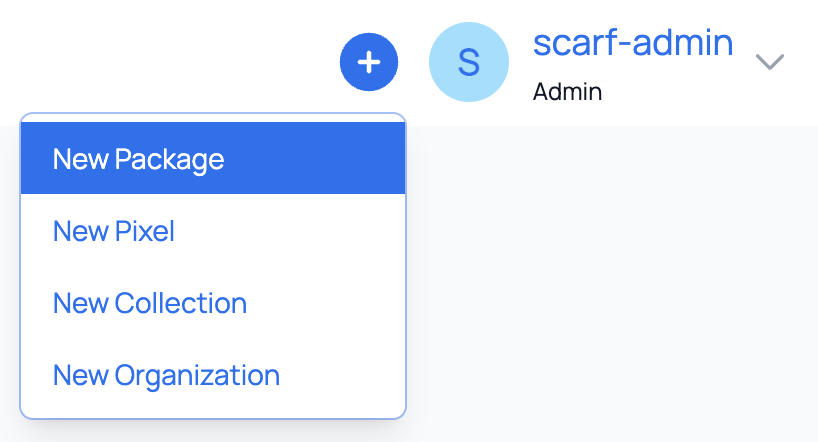
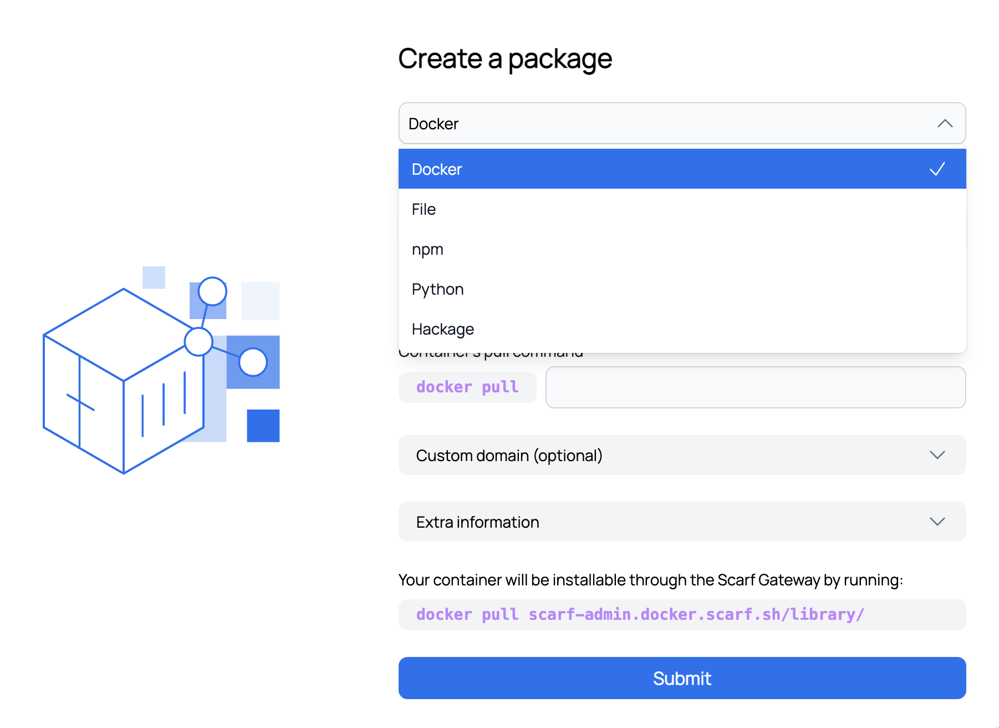
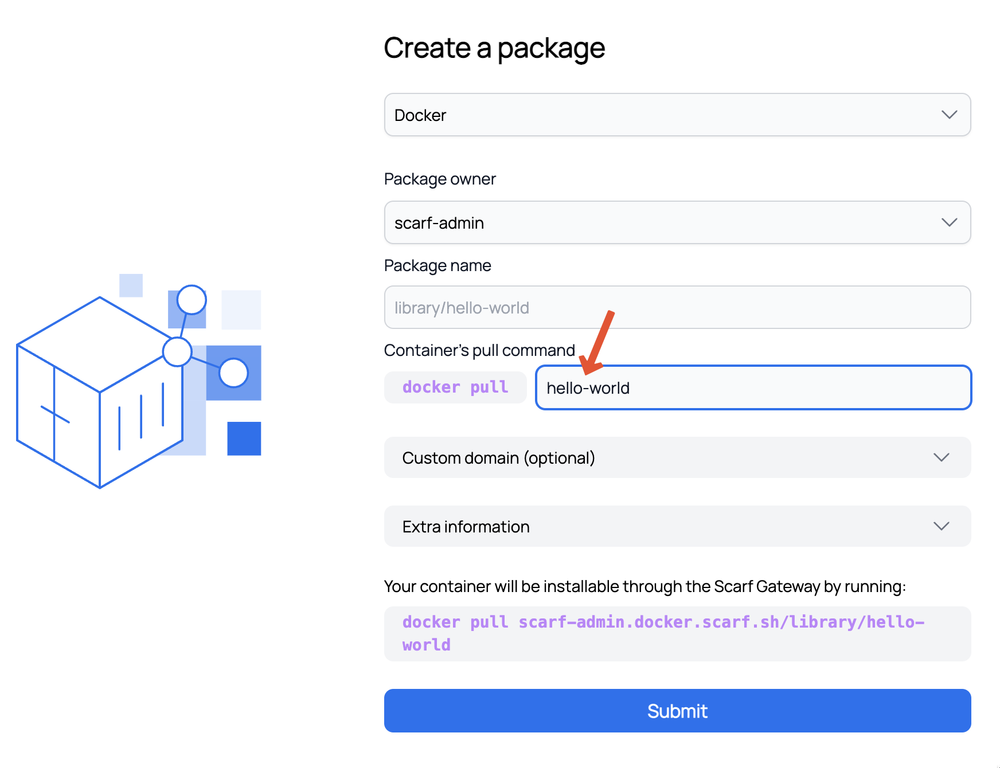
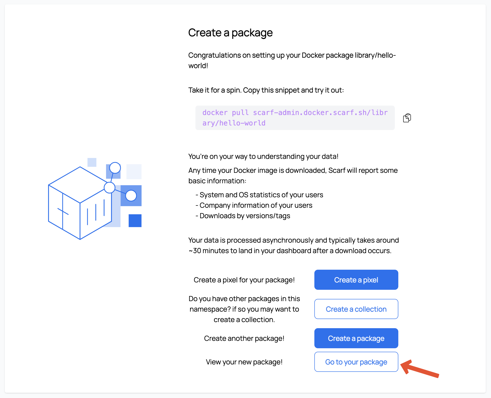
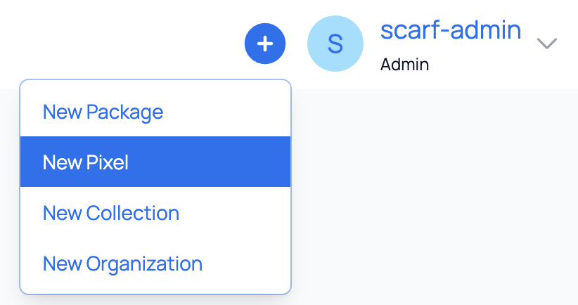
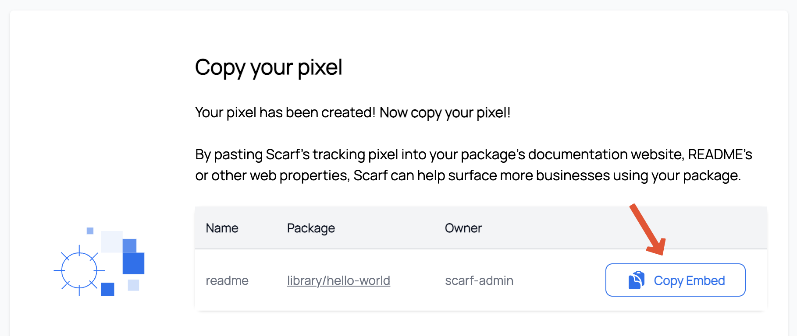

# 快速开始

## 简介

Scarf网关是一项服务，可以为您的容器(containers)和包(packages)提供中央接入点，无论您将它们托管在何处。

在本指南中，您将了解到：

- 如何用Scarf创建Docker容器的跟踪拉取
- 如何创建一个跟踪像素来跟踪您的包的文档的浏览情况
- 如何下载您的包并获取相关像素

## 先决条件

- 您需要注册一个 [Scarf账户](https://scarf.sh/signup)。您可以用一个有效的电子邮件地址或您的GitHub账户来注册。
- 您要追踪的容器必须发布到一个现有的公共注册表上，例如Docker Hub、GitHub容器注册表。本指南将使用 `hello-world` [docker镜像](https://hub.docker.com/_/hello-world)。

### 创建 Docker 包

使用 Scarf，用户可以使用您的自定义域通过 Scarf Gateway 拉取您的 Docker 容器镜像。

1.  登录 Scarf 后，导航至主页。

2. 单击顶部导航中的加号图标，然后选择 `New Package`.

3. 在第一个下拉菜单中单击您要创建的包类型。 对于本部分，您将单击 `Docker`.

4.  为您的 Docker 容器输入当前的拉取命令。 `hello-world` 包的 Docker 命令是`docker pull hello-world`.

    

5. 可选项：您可以添加自定义域或使用 Scarf Gateway 提供的域。

6. 单击 `Submit` 按钮将重定向到成功屏幕，其中包含一些关于您下一步可以做什么的附加信息。

7. 单击 `Go to your package` 以查看您的包的详细信息视图。

现在您已经准备好开始使用 Scarf 跟踪您的 Docker 镜像了。
任何时候您的镜像被下载，Scarf 都会报告一些基本信息：

- 您的用户的系统和操作系统统计信息
- 您的用户的公司信息
- 按版本/标签下载

在下一节中，您将创建一个跟踪像素，可以将其添加到您的项目文档或与您的项目相关的任何其他 Web 属性中。

### 为您的包创建跟踪像素

跟踪像素用于利用项目文档中的网络流量来了解哪些公司正在使用您的软件。

1. 导航到 [https://scarf.sh/home](https://scarf.sh/home).

2. 可以从两个位置创建像素，一个是直接从包详细信息视图。在顶部菜单中单击 `Tools` > `Packages`. 然后在下一个屏幕中找到我们的包 `hello-world` 并单击 `View details`.

在下一个屏幕上向下滚动到 `Tracking Pixel` 版块并单击 `Create pixel`.

第二种方法是单击顶部导航中的加号图标，然后选择 `New Pixel`.

3. 您现在将看到创建像素页面。 对于这个例子，我们将命名我们的像素 `readme`.

4. 然后将其附加到我们新创建的 `hello-world` 包中. （如果您通过 `create pixel page` 来到 `package details  page` ，这将被自动选中）

4. 最后点击 `Submit`

5. 复制新创建的像素 `` 标签并将其添加到您的网站、文档或其他任何与您的项目相关的 Web 属性上。

   

有关跟踪像素的更多信息，请参阅我们文档的 [文档洞察](../web-traffic/) 部分。

### 下载包并获取相关像素

在本部分中，您将使用包仪表板中的 pull 命令下载包以开始获取数据。

1. 导航到您的包的详细信息视图。
   
2. 复制Pull命令。
3. 导航到计算机上的终端并运行 Pull 命令。
   
   **注意：**确保 docker 守护进程正在您的计算机上运行。

4. 返回包详细信息视图并单击 `View Alytics`. 您现在应该看到 Package Insights 开始填充数据。
可能需要几分钟才能看到拉入的数据。

每次用户从 Scarf网关拉取您的 Docker 容器镜像时，您的 Package Insights 中的数据都会更新。

## 下一步？

有关 Scarf网关的更多详细信息，请参阅我们文档的 [Scarf网关](/gateway) 部分。
如果您有任何疑问或需要帮助，请加入我们的 [Slack 社区](https://tinyurl.com/scarf-community-slack)。
